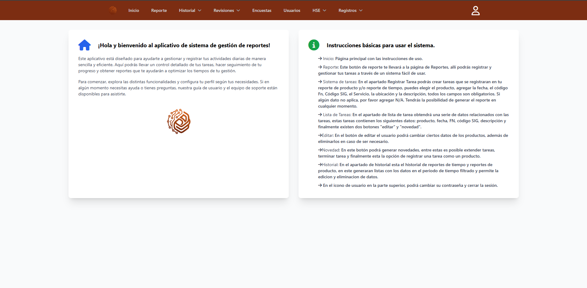
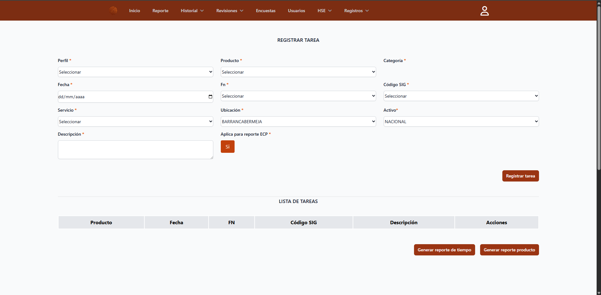
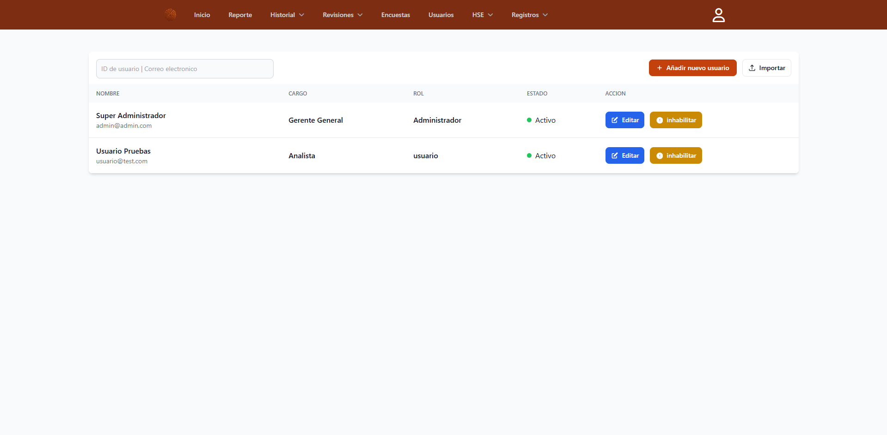
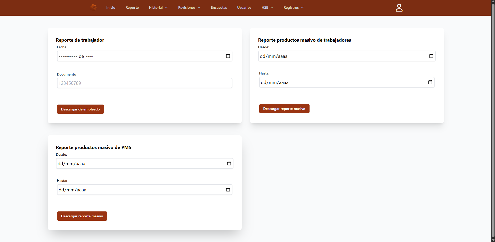

<h1 align="center">Sistema de Gestión de Reportes de Tiempo y Producto</h1>

  Proyecto desarrollado en <strong>Laravel</strong> como sistema interno empresarial
  para el registro y control de reportes de tiempo y reportes de producto.

---

## 📌 Descripción del proyecto

Este proyecto corresponde al desarrollo de un aplicativo web orientado a la
gestión de actividades diarias dentro de un entorno corporativo.

El sistema permite a los usuarios registrar tareas asociadas a productos,
servicios y códigos SIG, con el fin de llevar un control detallado del tiempo
invertido y de los productos generados, así como la generación de reportes
estructurados para análisis y seguimiento.

El desarrollo fue realizado completamente por mí, abarcando tanto el backend
como el frontend del sistema.

---

## 🎯 Objetivo del sistema

- Centralizar el registro de tareas diarias.
- Estandarizar los reportes de tiempo y producto.
- Facilitar la trazabilidad de actividades.
- Mejorar el control operativo y administrativo.
- Generar reportes exportables para análisis interno.

---

## 🧩 Funcionalidades principales

### 🏠 Inicio

- Página principal con mensaje de bienvenida.
- Instrucciones básicas para el uso del sistema.

### 📝 Registro de tareas

- Registro de tareas con campos como:
  - Perfil
  - Producto
  - Categoría
  - Fecha
  - FN
  - Código SIG
  - Servicio
  - Ubicación
  - Activo
  - Descripción
- Validación de campos obligatorios.
- Opción para indicar si la tarea aplica para reporte ECP.

### 📋 Lista de tareas

- Visualización de tareas registradas.
- Acciones disponibles:
  - Edición de tareas
  - Registro de novedades
  - Finalización de tareas

### 📊 Reportes

- Generación de:
  - Reporte de tiempo
  - Reporte de producto
- Filtros por rango de fechas.
- Exportación de reportes a archivos Excel.

### 🕒 Historial

- Consulta del historial de reportes.
- Gestión de registros según permisos del usuario.

### 👥 Gestión de usuarios

- Creación, edición e inhabilitación de usuarios.
- Asignación de roles, cargos y estados.
- Control de acceso según rol.

### 🔐 Seguridad

- Sistema de autenticación.
- Cambio de contraseña.
- Cierre de sesión seguro.

---

## 🛠️ Tecnologías utilizadas

### Backend

- Laravel
- PHP
- Eloquent ORM

### Frontend

- Blade
- Tailwind CSS
- JavaScript

### Base de datos

- MySQL / MariaDB

### Librerías y herramientas

- Laravel Excel (exportación de reportes)
- SweetAlert2 (alertas y confirmaciones)
- Git (control de versiones)

---

## 🖼️ Evidencia visual del proyecto

> Las siguientes imágenes corresponden a capturas reales del sistema en funcionamiento.

### Página de inicio

### Registro de tareas

### Gestión de usuarios

### Descargar reporte de productos

Este modulo solo es permitido para ciertos usuarios.

---

## 👨‍💻 Mi rol en el proyecto

- Análisis de requerimientos.
- Diseño de la arquitectura del sistema.
- Desarrollo backend en Laravel.
- Desarrollo frontend con Blade y Tailwind CSS.
- Implementación de validaciones y seguridad.
- Generación y exportación de reportes.
- Pruebas funcionales del sistema.

---

## 📄 Aviso legal

Este proyecto fue desarrollado como sistema interno para una empresa.
El código fuente no se encuentra disponible públicamente por tratarse de
un desarrollo empresarial.

Este repositorio se presenta únicamente con fines demostrativos
y como parte del portafolio profesional del autor.

---

## ✍️ Autor

**Yona Vi**  
Desarrollador Web – Laravel  
Proyecto incluido como experiencia profesional en portafolio.
